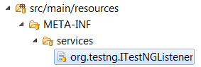

# listener-chain
ListenerChain for TestNG

**Selenium Foundation** relies on **TestNG Foundation** for basic flow control. At the heart of it all is `ListenerChain`. To provide consistent behavior, we recommend that you activate `ListenerChain` via the **ServiceLoader** as described in the [TestNG documentation](http://testng.org/doc/documentation-main.html#listeners-service-loader "Specifying listeners with ServiceLoader"):

#### org.testng.ITestNGListener
```
com.nordstrom.automation.testng.ListenerChain
```
In a Maven project, the preceding file is stored in the `src/main/resources` package:



Once this file is added to your project, `ListenerChain` will be loaded automatically whenever you run your tests. To request dynamic listener chaining, your test class implements the `ListenerChainable` interface:
```java
package com.nordstrom.example;

import com.nordstrom.automation.selenium.listeners.DriverManager;
import com.nordstrom.automation.testng.ExecutionFlowController;
import com.nordstrom.automation.testng.ListenerChain;
import com.nordstrom.automation.testng.ListenerChainable;

public class ExampleTest implements ListenerChainable {
	
	...
 
	@Override
	public void attachListeners(ListenerChain listenerChain) {
		listenerChain.around(DriverManager.class).around(ExecutionFlowController.class);
	}
}
```
As shown above, we use the `attachListeners()` callback to attach `DriverManager` and `ExecutionFlowController`. The order in which listener methods are invoked is determined by the order in which listener objects are added to the chain. Listener _before_ methods are invoked in last-added-first-called order. Listener _after_ methods are invoked in first-added-first-called order. Only one instance of any given listener class will be included in the chain.
